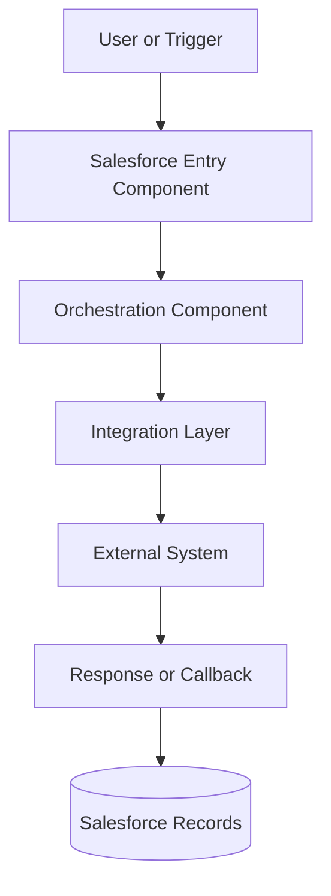
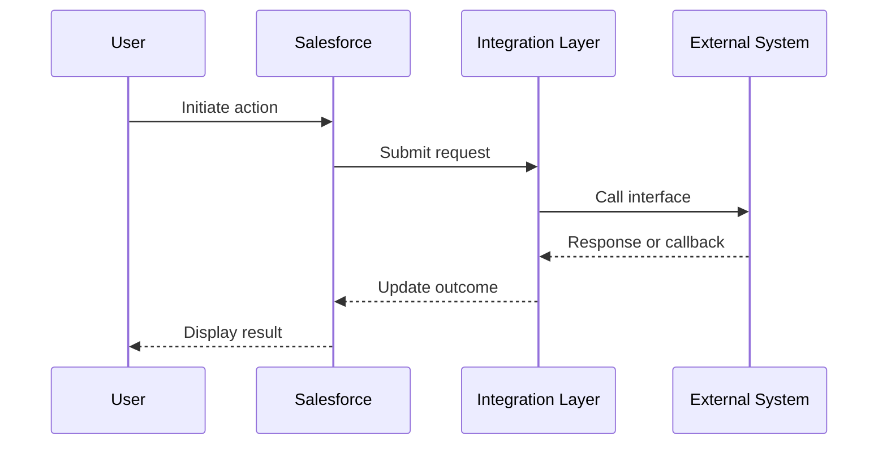

# Technical Architecture Review

Create Technical Architect notes grounded in Jira requirements, current Salesforce implementation evidence, and vetted GM enterprise context. Never present assumptions as facts.

## Workflow

Track these steps:

```text
- [ ] 1. Collect the story and source inputs
- [ ] 2. Retrieve Jira requirements and acceptance criteria
- [ ] 3. Research historical and integration context in Glean
- [ ] 4. Inspect Salesforce implementation metadata
- [ ] 5. Reconcile requirements, context, and implementation
- [ ] 6. Generate TA notes and optional Mermaid diagrams
- [ ] 7. Validate evidence, citations, and open questions
```

## 1. Collect inputs

Ask for all missing inputs in one message:

1. Jira story key or URL.
2. Salesforce source:
   - local repository path (default: current workspace), or
   - GitHub repository and branch.
3. Optional Salesforce org alias/username when org metadata must supplement the repository.
4. Output path (default: `~/Desktop/<JIRA_KEY>_technical_architecture_review.md`).
5. Diagram preference: `none`, `flowchart`, `sequence`, or `both`.
6. Optional focus areas, known systems, or concerns.

The Jira story is required. Prefer repository metadata as implementation truth; use org metadata to fill gaps or validate deployed configuration.

## 2. Retrieve Jira requirements

Use the available Jira MCP tools. Retrieve:

- key, title, description, status, issue type, parent/feature, labels, fix version
- acceptance criteria
- linked issues, dependencies, and direct child stories when relevant
- technical notes and implementation notes

If the Jira tools are unavailable or access is denied, ask the user to paste the story and acceptance criteria. Do not invent missing Jira content.

Normalize the requirements into:

```text
Business objective
Actors/personas
Acceptance criteria (AC1, AC2, ...)
Functional rules
Data requirements
Integration requirements
Security/access requirements
Dependencies and constraints
```

Extract search terms for later steps:

- exact Jira key and parent key
- distinctive phrases from the title and acceptance criteria
- Salesforce component/API names
- business capabilities and objects
- external systems, APIs, events, queues, and integration aliases

Show the normalized acceptance criteria and ask the user to confirm only when Jira content is ambiguous or contradictory. Otherwise continue autonomously.

## 3. Research GM context with Glean

Use Glean MCP for enterprise context. Do not claim to retrieve “all” history; retrieve all relevant, accessible evidence found through a systematic search.

### Search strategy

1. Use Glean `chat` for an initial cross-source overview of the capability, historical decisions, integrations, owners, and terminology.
2. Use Glean `search` with separate focused queries:
   - exact Jira key and parent/feature key
   - story title and distinctive acceptance-criteria phrases
   - each named integration or external system
   - Salesforce component names discovered from Jira or metadata
   - architecture decisions, interface contracts, data mappings, and error handling
3. Use `read_document` for the strongest results before relying on them.
4. Refine searches with aliases and terminology discovered in earlier results.

Do not pad the review with weak keyword matches. Three strong sources are better than ten weak ones.

### Source vetting

For every source used, assess:

- **Relevance:** directly supports the story, capability, component, or integration.
- **Authority:** approved architecture/specification > team wiki > meeting notes > informal discussion.
- **Freshness:** under 6 months = current; 6–12 months = potentially stale; over 12 months = historical context only unless independently confirmed.
- **Agreement:** flag conflicts instead of silently choosing one source.

Record each source as:

```text
Title | URL | Source type | Last updated | Confidence | Supported claim
```

Never expose unrelated internal content. Cite only sources needed to support the review.

## 4. Inspect Salesforce implementation metadata

Start from the Jira key, component names, objects, and integration terms. Use dedicated file search/read tools for local repositories. Use GitHub tooling for GitHub sources. When an org is provided, use Salesforce MCP or Salesforce CLI to supplement the repository.

### Repository discovery

Search for:

- Jira key in commit messages, branches, filenames, and source content
- names and labels from the acceptance criteria
- referenced objects, fields, record types, permission sets, flows, and components

Inspect relevant metadata, including:

- Apex classes, triggers, tests, callouts, async jobs
- Flows and subflows
- OmniScripts, Integration Procedures, DataRaptors
- LWC and Aura components
- objects, fields, validation rules, record types, layouts
- permission sets, custom permissions, sharing configuration
- Named Credentials, External Credentials, Remote Site Settings
- Platform Events, Change Data Capture, queues, scheduled jobs
- Custom Metadata, Custom Settings, Custom Labels

Trace only relationships supported by metadata. For integrations, capture:

```text
Initiator -> component -> endpoint/system -> authentication -> payload/data mapping
-> response/callback -> error handling -> retries/timeouts -> Salesforce records updated
```

Never include secrets, access tokens, credential values, or sensitive payload data.

### Evidence classification

Classify every material statement:

- **Implemented:** directly supported by metadata/code.
- **Documented:** supported by an authoritative Glean source.
- **Required:** stated by Jira/acceptance criteria.
- **Inferred:** reasonable but not directly proven.
- **Unknown:** evidence is missing or conflicting.

Do not promote `Inferred` or `Unknown` statements to facts.

## 5. Reconcile the evidence

Build an acceptance-criteria traceability matrix:

```text
AC | Requirement | Implementing components | Historical/design context
| Verification evidence | Status | Gaps
```

Allowed status values:

- `Supported` — implementation evidence addresses the AC.
- `Partially supported` — some required behavior has evidence.
- `Not found` — no implementation evidence was located.
- `Conflicting` — sources or implementation disagree.
- `Not assessable` — requires runtime or unavailable evidence.

Check specifically for:

- undocumented dependencies or integrations
- differences between Jira, historical design, and current metadata
- missing security, error-handling, observability, or data-volume considerations
- backward compatibility and shared-component impact
- deployment ordering and configuration dependencies
- testability and operational support

## 6. Generate the review

Write the output in Markdown:

```markdown
# <JIRA_KEY> — Technical Architecture Review

## Review Summary
Decision: Ready / Ready with Conditions / Revision Required / Insufficient Evidence
Confidence: High / Medium / Low
[Concise explanation]

## Story and Business Objective
[Title, objective, actors, and intended outcome]

## Acceptance Criteria
[Numbered normalized criteria]

## Historical and Architectural Context
[Vetted decisions and prior context with inline source links]

## Current Implementation
### Component Inventory
| Component | Type | Purpose | Evidence |

### End-to-End Behavior
[Step-by-step implementation narrative]

## Integration Architecture
| Integration | Direction | Interface | Authentication | Data | Error Handling |

## Data, Security, and Access
[Objects/fields, permissions, sharing, sensitive data considerations]

## Acceptance-Criteria Traceability
| AC | Requirement | Components | Evidence | Status | Gaps |

## Architecture Assessment
### Strengths
### Risks and Gaps
### Nonfunctional Considerations
### Dependencies and Deployment Considerations

## Technical Architect Notes
[Specific findings and decisions written for implementation teams]

## Recommendations
1. [Prioritized, actionable recommendation]

## Open Questions
- [Only unresolved questions that materially affect the review]

## Sources
| Title | URL | Last Updated | Confidence | Usage |

## Evidence Limitations
[Unavailable systems, stale sources, runtime behavior not verified]
```

Do not include empty sections; state `No material findings` when an expected review area was assessed and no issue was found.

### Decision rules

- **Ready:** ACs are supported and no material architecture gap remains.
- **Ready with Conditions:** implementation is viable but named actions must be completed.
- **Revision Required:** material requirement, security, integration, or operability gaps exist.
- **Insufficient Evidence:** unavailable or contradictory evidence prevents a defensible decision.

## 7. Optional Mermaid diagrams

Generate diagrams only when requested. Base every node and edge on cited documentation or implementation metadata.

### Flowchart

Use for component and business flow. Keep it to 6–12 primary nodes:



### Sequence diagram

Use for synchronous/asynchronous integration behavior:



Replace generic labels with actual component and system names. If an edge is inferred, label it `Unverified` and explain it in Evidence Limitations. Split diagrams that exceed 12 nodes.

## Final validation

Before reporting completion:

- Every acceptance criterion appears in the traceability matrix.
- Every architecture claim is supported or explicitly classified as inferred/unknown.
- Every Glean-derived claim has a URL, last-updated date, and confidence.
- Sources older than 12 months are labeled historical unless independently confirmed.
- Conflicting sources and missing evidence are visible.
- Mermaid syntax uses only supported flowchart or sequence formats.
- No credentials, tokens, or sensitive values appear in the document.

Report the output path, decision, confidence, components reviewed, sources used, and number of open questions.
